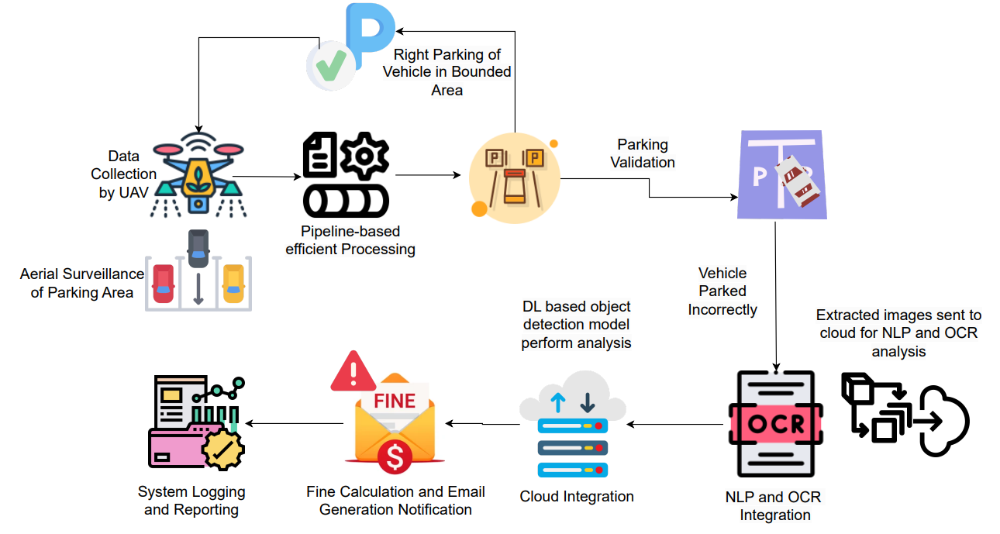

# DroneParkingGuard 🚁🅿️  
**AI-enabled False Parking Detection using UAVs, YOLOv8, and OCR**

[](https://www.python.org/)  
[](https://github.com/ultralytics/ultralytics)
[](https://github.com/PaddlePaddle/PaddleOCR)

---

## Overview  
This repository contains the official implementation of our research work:  
**"AI-enabled False Parking Detection" (2025)**.  

The system uses **Unmanned Aerial Vehicles (UAVs)** equipped with cameras and integrates them with **AI-based object detection (YOLOv8)** and **OCR** to:  
- Detect vehicles parked in unauthorized areas  
- Extract license plate details  
- Notify owners via automated alerts  

This framework helps universities, smart cities, and organizations **automate parking enforcement**, reduce congestion, and ensure fair parking access.

---

## Features  
-  Real-time **drone-based monitoring**  
-  **YOLOv8** for false parking detection  
-  **OCR** for license plate extraction  
-  Owner identification via database lookup  
-  Automatic **email notifications** for violations  
-  Lightweight & scalable to smart city use cases  

---
## 📊 Flowchart and Infographics  

<p align="center">
  <br>
  <em>Figure 1: Federated Learning setup for UAV-based false parking detection.  
  Each drone (client) trains a local model, sends encrypted weights to the server,  
  and receives updated global weights after aggregation.</em>
</p>

<p align="center">
  <br>
  <em>Figure 2: End-to-end system pipeline for false parking detection.  
  UAVs collect parking data → YOLOv8 detects violations → OCR extracts license plates →  
  Cloud system triggers fine calculation, reporting, and automated email notifications.</em>
</p>

---

## 🚀 Getting Started  

### 1️⃣ Clone Repository  
```bash
git clone https://github.com/your-username/DroneParkingGuard.git
cd DroneParkingGuard
```

### 2️⃣ Install Dependencies
```
pip install -r requirements.txt
pip install paddleocr
pip install paddlepaddle
```

### 3️⃣ Run Detection
```
python final_false_parking_detection.py --video test.MP4
```

### 4️⃣ Run OCR
```
python ocr.py --image output_with_boxes.jpeg
python paddle_ocr.py --image output_with_boxes.jpeg
```

## 🛠️ Tech Stack

- Detection: YOLOv8 (Ultralytics), PyTorch
- OCR: PaddleOCR, Tesseract
- Drone Control: PlutoCam – Drona Aviation
- Hardware: PlutoX Nano UAV
- Annotation Tool: CVAT
- Libraries: OpenCV, Pandas, Numpy

## 🙌 Acknowledgements

- DronaAviation for the PlutoCam drone camera streaming & control codebase, which served as the foundation for our UAV integration.
- Ultralytics for YOLOv8.
- PaddleOCR & Tesseract for license plate recognition.

## 📬 Contact
Jay Gor - jaygor162@gmail.com
Karm Dave -  1404kd@gmail.com  
